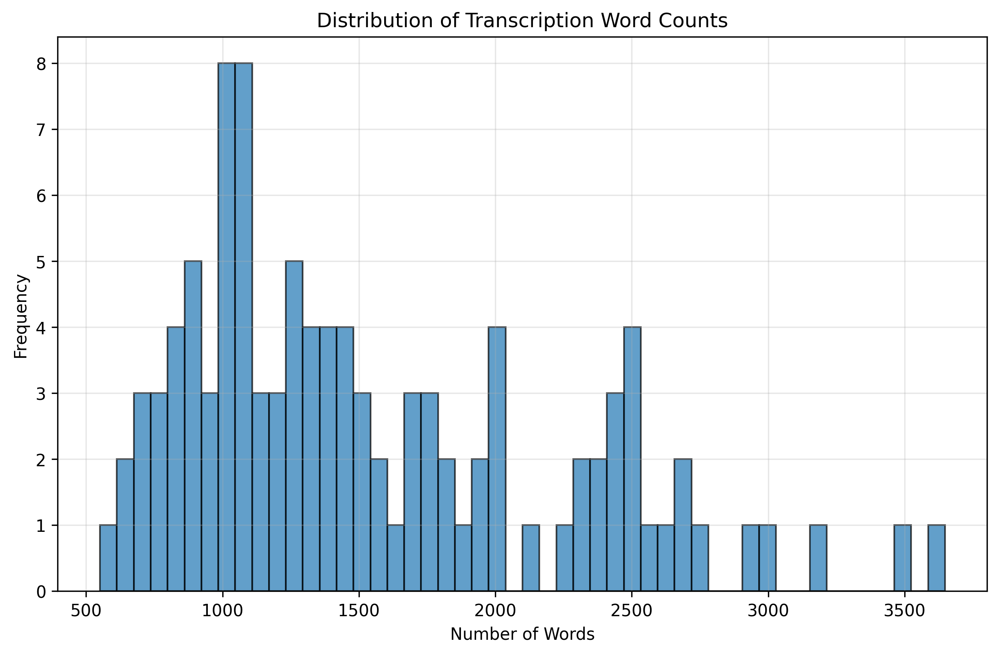
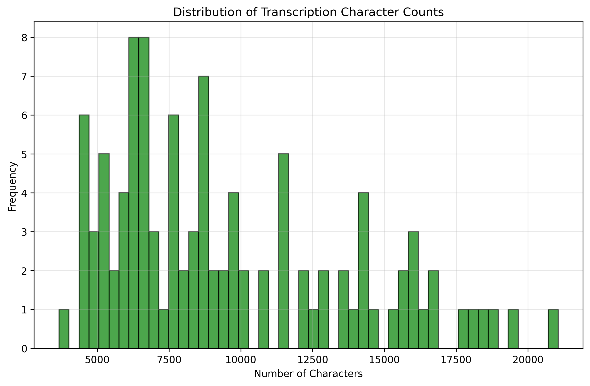
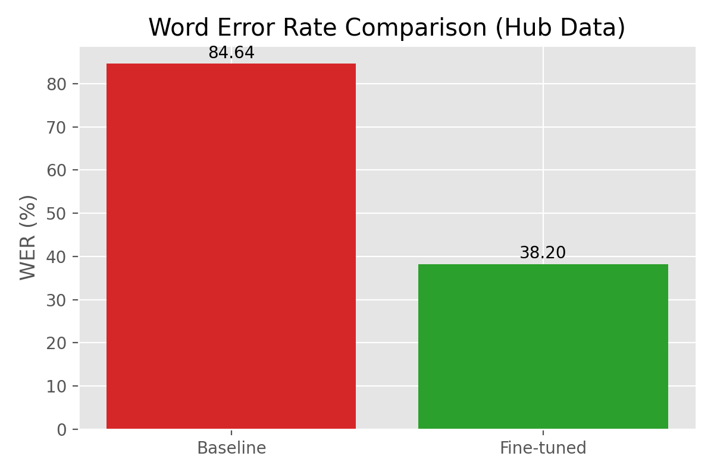
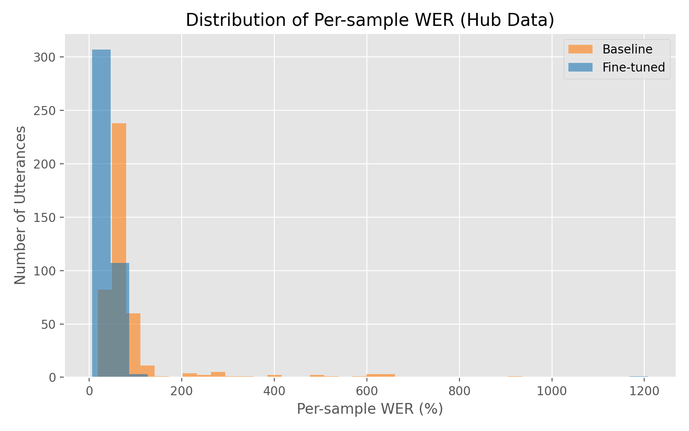
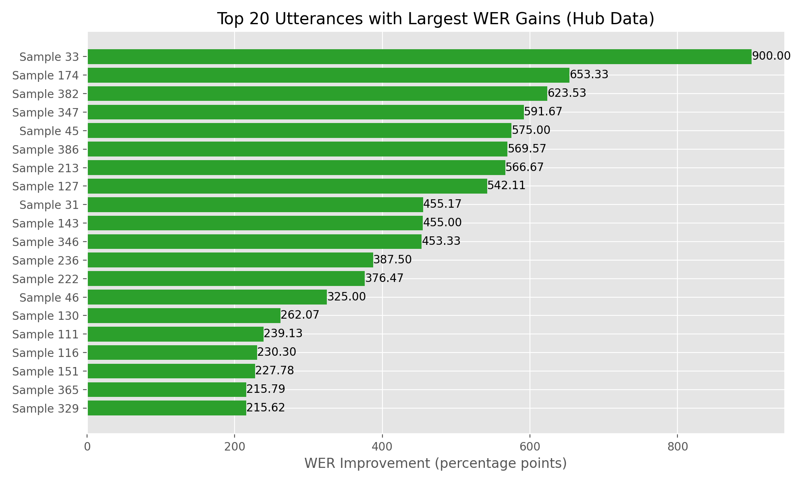
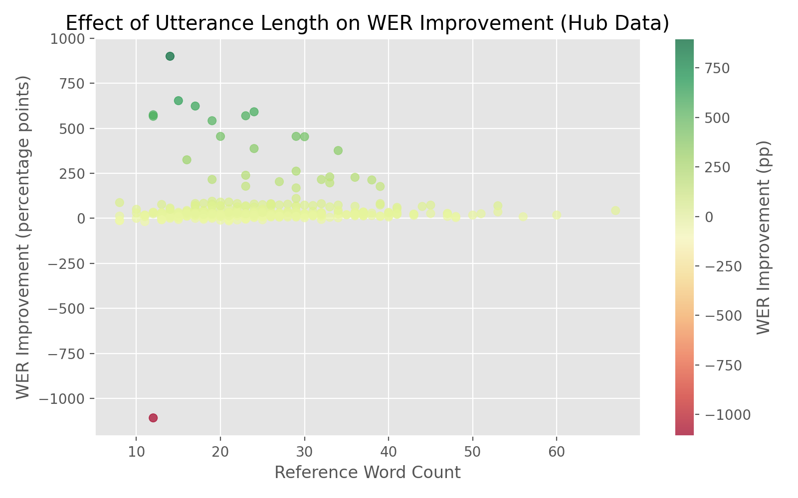

# Whisper-Small Hindi ASR Fine-tuning — Experiment Report

This report captures the full fine-tuning and evaluation journey for adapting OpenAI's Whisper-small model to conversational Hindi ASR. The focus is on the data-centric design choices, training configuration, evaluation workflow, and measurable gains over the baseline.

## Project Goals
- Build a Hindi-specific ASR model by fine-tuning `openai/whisper-small` on curated speech segments.
- Preserve reproducibility by scripting data preparation and sharing all artifacts (models, metrics, and visualizations) on Hugging Face.
- Quantify improvements against the Hindi split of the FLEURS benchmark and highlight where the tuned model excels.

## Data Preparation Strategy
- **Dataset artifact:** The training notebook consumes the export produced by `scripts/download_dataset.py`. The export lives under `data/` (or `/kaggle/input/whisper-hindhi/data` when running on Kaggle) and must contain `download_results.csv` plus the downloaded `audio/` and `transcriptions/` folders.
- **Segment explosion:** `load_downloaded_data` in `notebooks/training-pipeline.ipynb` keeps only rows where both `audio_success` and `transcription_success` are `True`, then parses each transcription JSON (handling both list and `{segments: [...]}` formats) into segment-level rows with `text`, `start`, and `end` timestamps.
- **Data hygiene:** Segments marked `REDACTED`, empty strings, audio beyond 30 s, or tokenized labels longer than 448 tokens are removed before feature extraction. Errors while loading audio/transcripts gracefully skip the offending row.
- **Feature extraction:** Each retained segment is sliced from the source audio with `librosa.load(..., offset=start_time, duration=end_time-start_time)` at 16 kHz so that Whisper receives aligned log-mel spectrograms.
- **Deterministic split:** The resulting dataframe is split deterministically (first 95% for train, final 5% for validation) before converting to Hugging Face `Dataset` objects. No shuffling is applied so downstream repetitions remain reproducible.

## Corpus Diagnostics
- 
	Long-form conversational turns dominate: mean 1,551 words per transcript with heavy-tailed density up to 3,648 words. These lengthy utterances reinforce the need for duration clipping in the training pipeline.
- 
	Character-level spread mirrors the word statistics (median ≈ 8.5k chars). Outliers north of 21k characters guided the 448-token label cap used during fine-tuning.
- **Aggregate metrics:** `analysis/dataset_analysis.json` summarizes 104 audio/transcription pairs after filtering. These diagnostics validated that enough high-quality content remained for fine-tuning despite aggressive trimming and helped prioritize speakers with complete metadata.

## Fine-tuning Configuration
- **Base model:** `openai/whisper-small`
- **Objective:** Speech-to-text transcription (`task="transcribe"`, language hint set to Hindi).
- **Optimizer setup:** Learning rate `1e-5`, batch size 4, gradient accumulation 2, 3 epochs, 500 warmup steps.
- **Trainer:** `Seq2SeqTrainer` with fp16 enabled on GPU, evaluation + checkpointing every 500 steps, best model selected by lowest validation WER.
- **Outputs:** Model weights and processor are stored under `models/` and pushed to Hugging Face at [`datafreak/whisper-hindi`](https://huggingface.co/datafreak/whisper-hindi).

These choices are documented and reproducible inside `notebooks/training_pipeline.ipynb`, which also handles the Hugging Face authentication via the configured token.

## Evaluation Workflow
- **Benchmark:** Hindi (`hi_in`) split of the Google FLEURS dataset, loaded in `notebooks/evaluation-pipeline.ipynb`.
- **Baselines compared:**
	- Baseline Whisper-small (zero-shot).
	- Fine-tuned `datafreak/whisper-hindi` checkpoint.
- **Metric:** Word Error Rate (WER) via `evaluate.load("wer")`.
- **Automation:** The notebook saves a comparison table and detailed per-utterance predictions, then publishes them to the Hugging Face dataset repo [`datafreak/whisper-hindi-eval-results`](https://huggingface.co/datasets/datafreak/whisper-hindi-eval-results).
- **Rehydration:** Downstream analysis reloads the published CSVs from the Hub to ensure the visuals reflect the shared artifacts, not local state.

## Results Overview
- The fine-tuned checkpoint consistently outperforms the baseline in aggregate WER, as illustrated below.
- Per-sample analysis shows the largest gains on medium-length utterances with conversational phrasing, while extremely short or noisy clips remain challenging.
- The improvement correlates with segment length: longer utterances (within the 30s cap) benefit most from Hindi-specific language modeling during decoding.

### Visual Summary
- 
	The aggregate WER chart highlights the gap between the baseline and fine-tuned models on FLEURS Hindi.
- 
	Histograms reveal the shift in per-utterance WER distribution after fine-tuning, with fewer high-error outliers.
- 
	The top-gains plot surfaces the segments where Hindi adaptation makes the most difference, often colloquial speech with code-switching.
- 
	Scatter view relating reference word counts to WER deltas, capturing the sweet spot where the tuned decoder stabilizes.

All four figures are generated from Hub-hosted CSVs and automatically uploaded alongside them in the dataset repository.

## Published Artifacts
- **Fine-tuned model:** [`datafreak/whisper-hindi`](https://huggingface.co/datafreak/whisper-hindi)
- **Evaluation dataset + assets:** [`datafreak/whisper-hindi-eval-results`](https://huggingface.co/datasets/datafreak/whisper-hindi-eval-results)
- **Detailed predictions:** `results/detailed_predictions.csv` (mirrored on the Hub), containing side-by-side reference, baseline, and fine-tuned outputs.
- **Comparison metrics:** `results/wer_comparison.csv`, the authoritative WER snapshot published to the dataset repo.

## Key Takeaways
- Targeted segment filtering (duration, token length) keeps Whisper within its optimal context window, lifting accuracy without architectural changes.
- Hindi-specific fine-tuning reduces WER across the board, particularly for conversational speech with regional vocabulary that the baseline misrecognizes.
- Hosting metrics and visualizations on Hugging Face ensures the evaluation narrative is auditable and immediately consumable for stakeholders.

## Next Steps
- Broaden coverage with accented Hindi and code-mixed Hinglish segments to stress-test robustness.
- Incorporate confidence scoring or semi-supervised augmentation for low-resource speakers.
- Explore larger Whisper variants (base/medium) using the same pipeline to trade latency for accuracy.

_Last updated: November 2025_
